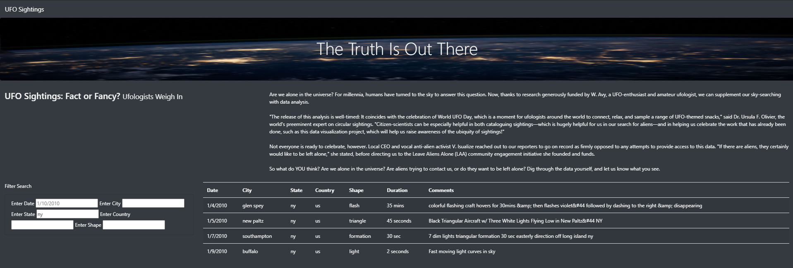

# UFOs

## Goals

The objectives is to:
- Create, update, and deploy JavaScript functions to provide additional table filters.
- Update and deploy forEach (for loop) to loop through the filters and update them with user input.
- Update and populate the dynamic filters and table using JavaScript and HTML.

## Resources

- index: cf. **index** file

- other structures: cf. **static** folder

## Technologies used

- JavaScript:
    - version ES6+
    - D3.js
- HTML (Bootstrap’s CDN)
- CSS

## Recommendation for further development

In order to strengthen the research on the website, we could include an additional filter easily implemented: the ability to search by keywords into the *Comments* column.

Indeed, and for instance, it could be interesting to find all events where people saw an aircraft by typing "aircraft" into the new filter.

Additionally, some data cleaning might be necessary as some typos or special characters are present into the *Comments* data.

## Website Overview

> :alien: *Zoom level: 50%*

